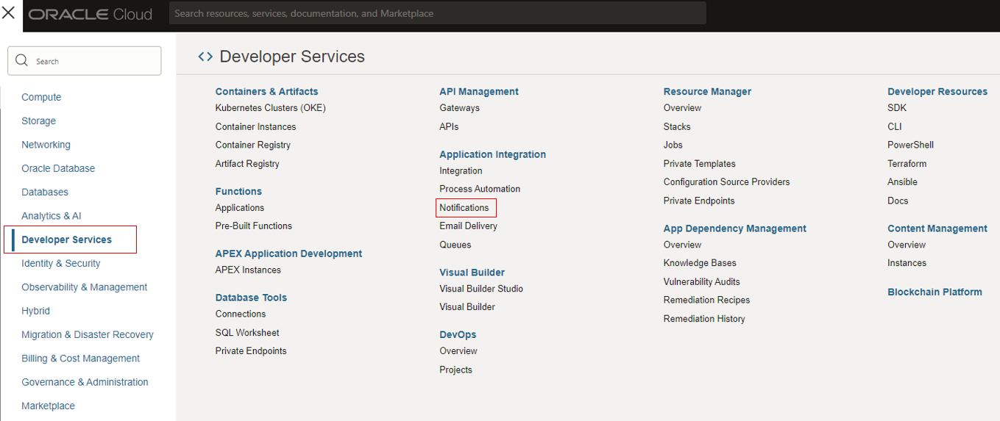
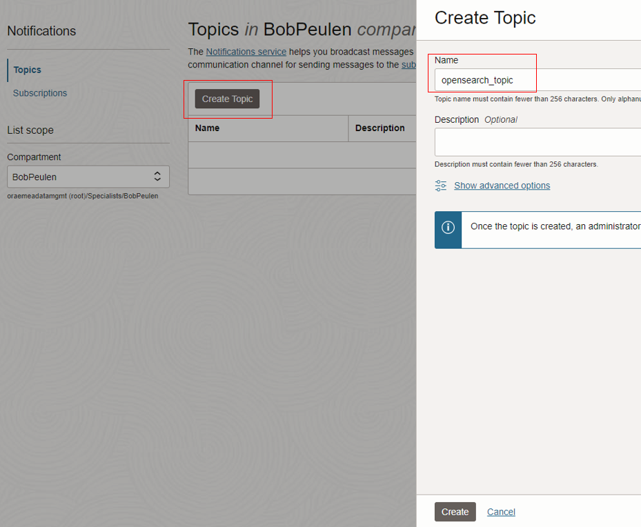
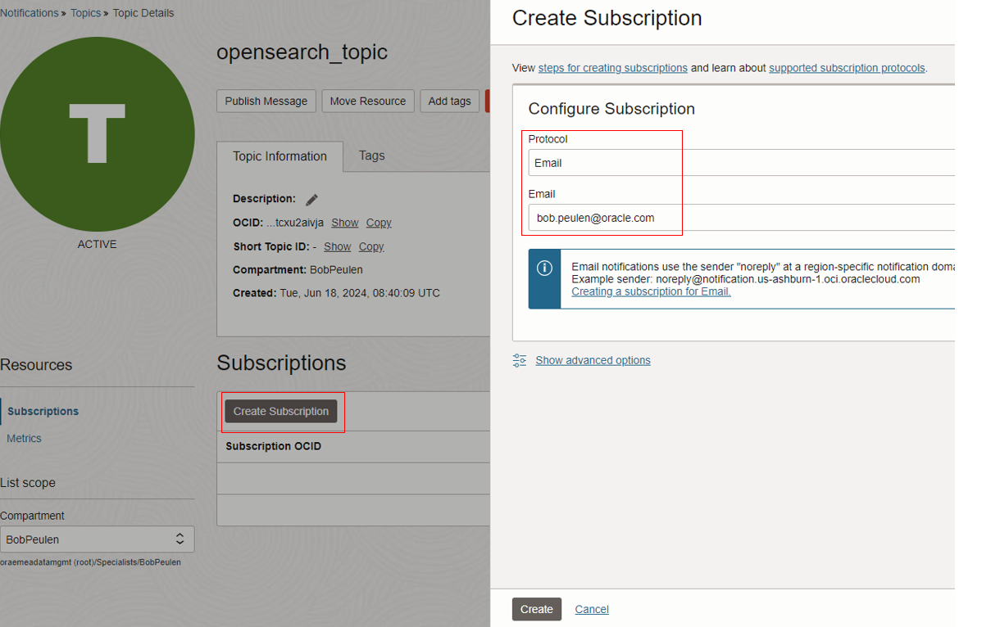
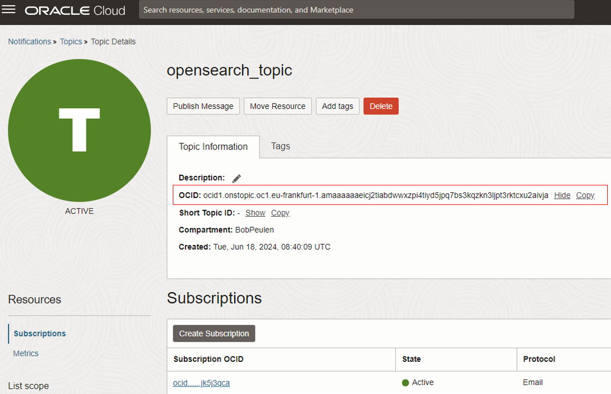

# Lab 1 - Get started

## Introduction

In this lab,xx

*Estimated Time:* 30 minutes

### Objectives

In this lab, you will:
* Create a VCN and configure the ports
* Create an OCI OpenSearch Cluster
* Create an Oracle Notification Service (ONS) topic
* Create a jumphost to access the dashboards

## Task 1: Create a VCN and configure the ports

1.	x
    

2. G

## Task 2: Create an OCI OpenSearch Cluster

Second, you will create an API Key. This API Key is needed to authenticate yourselves to invoke or use other services. Both APEX and OCI Data Science will need your API Key.

1. In the top-right corner, click the person Icon.
2. 

## Task 3: Create an Oracle Notification Service (ONS) topic

In this task, you will create an ONS topic and add your personal or work-related e-mail to the service. At the end of the workshop, the ONS topic will be invoked to report detected anomalies directly in your e-mail.

1. Go to the Oracle Cloud homepage and click on the hamburger menu. Following, click on **Developer Services** and click next on **Notifications**
2. On the next page, click on **Create Topic**. Add a name to the **Name** box and click on **Create**.
3. Click on the newly created topic to open the topic. When the topic is not directly visible, refresh the page.
4. Click on **Create Subscription**. Use **E-mail** as protocol and add your work or personal e-mail to the **Email" box. Click on **Create**.
   
   
   
   
   
   

6. The notification service has sent you an e-mail. Please go to your personal or work-related inbox and click on **Confirm Subscription**.
7. Return to your created topic and copy the Topic's OCID. You will need this OCID later.
   

## Task 4: Create a jumphost to access the dashboards

1.	C

You may now **proceed to the next lab.**

## Acknowledgements
* **Authors**:
    * x
    * x
* **Last Updated By/Date** -xa, July 2024
