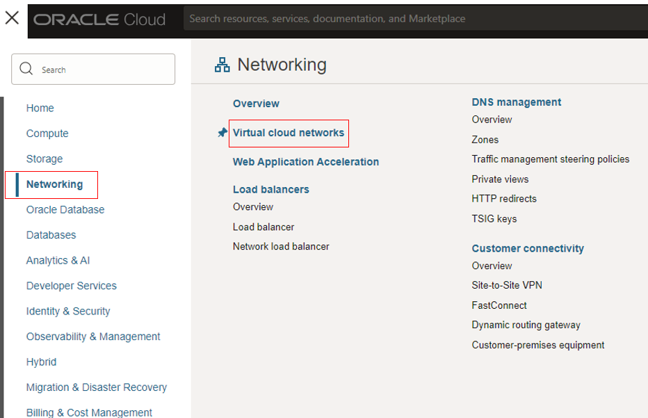
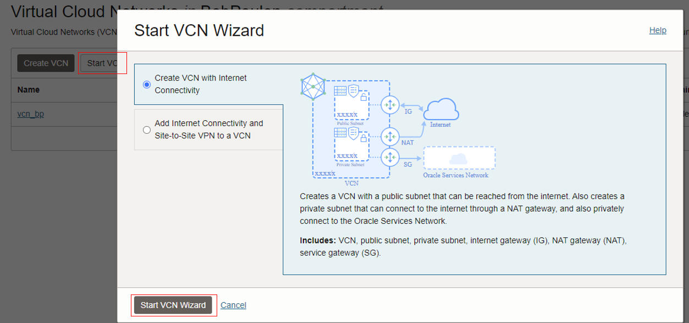
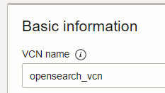
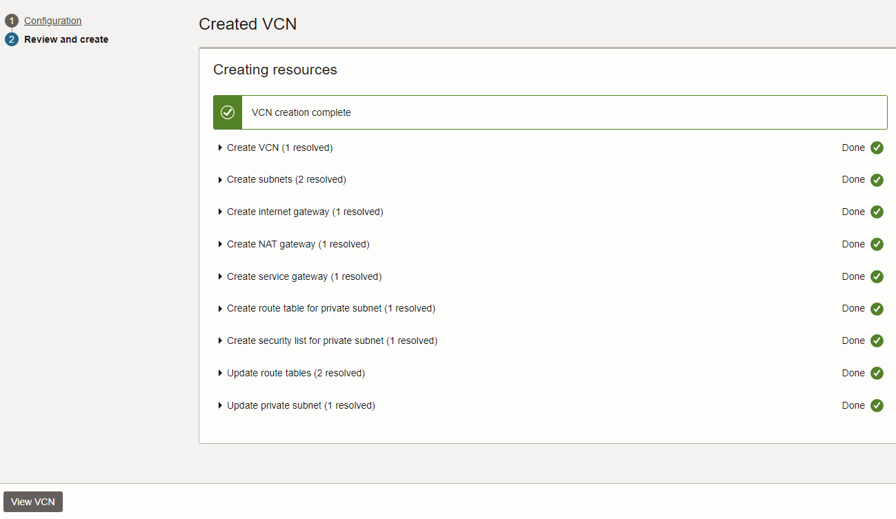
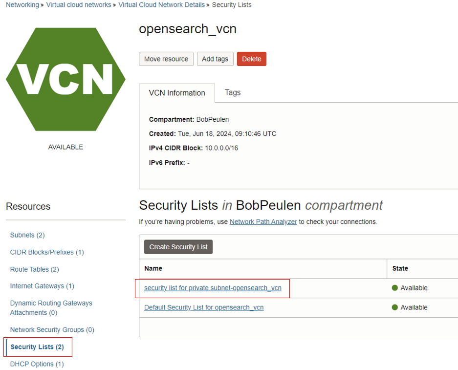
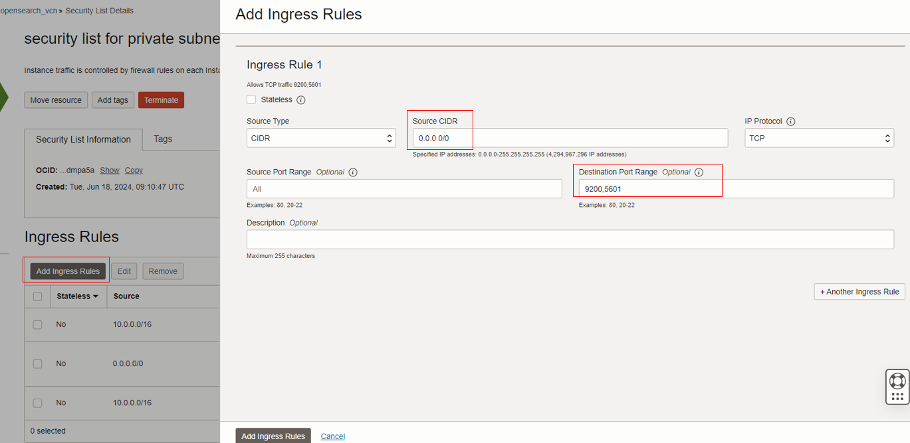
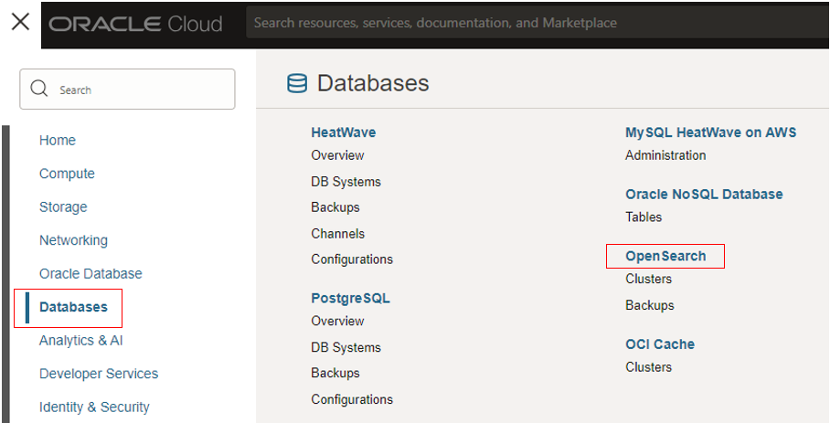
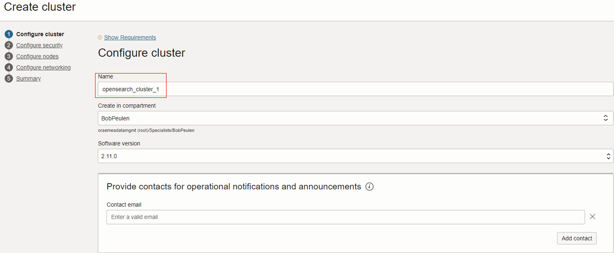
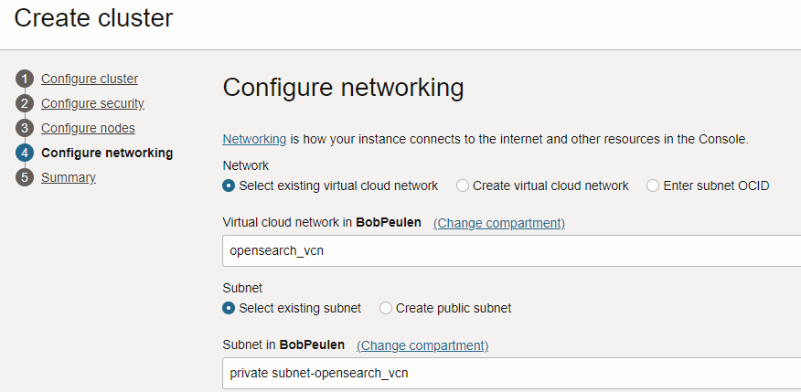
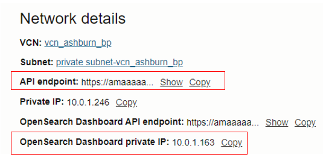

# Lab 1 - Get started

## Introduction

In this lab,xx

*Estimated Time:* 30 minutes

### Objectives

In this lab, you will:
* Create a VCN and configure the ports
* Create an OCI OpenSearch Cluster
* Create an Oracle Notification Service (ONS) topic

## Task 1: Create a VCN and configure the ports

1.	From the Oracle Cloud homepage, click on the hamburger icon, click on **Networking** and following click on **Virtual Cloud Networks**.

2.	Click on **Start VCN Wizard**, choose the **Create VCN with Internet Connectivity** option and click on **Start VCN Wizard** again.
   
    
  	
  	

3. Add a logical name in the **VCN Name** box. Following, click on **Next** and then click on **Create**. This will create a VCN with a public and a private subnet. When all items are completed, click on **View VCN**.

    
   
    
   
5. To make sure you can access the OCI OpenSearch cluster and dashboard, we have to open two ports. On the left side, click on **Security Lists** and following click on **Security list for private_subnet-[name of VCN]**
   
    

7. In the security list, click on **Add Ingress Rules**. Add "0.0.0.0/0" to the **Source CIDR** box and add "9200,5601" to the **Destination Port Range**. Leave the other boxes empty or default. Click on **Add Ingress Rules**.
   
    

## Task 2: Create an OCI OpenSearch Cluster

1. Click on the hamburger menu, go to **Databases** and following click on **OpenSearch**. In the next screen, click on **Create Cluster**.

   

2. In the **Configure cluster** screen. Add a logical name to the **Name** box. Make sure the software version is 2.11.0. Optionally, add your e-mail to the contact e-mail box. Click on **Next**

3. In the **Configure security** screen, add a **username** and **password**. You will need these credentials later. Click on **Next**.

4. In the **Configure nodes** screen, leave the default settings as they are. Optionally, you may increase the nodes. Click on **Next**.

5. In the **Configure networking** screen, please select the VCN you just created and select the associated **Private subnet**. Click on **Next**.

6. Review the summary and click on **Create cluster**. Afterwards, click on **View details**. The creation of a cluster might take several minutes. Step inside the cluster by clicking the name.

   

   

7. When the OpenSearch Cluster has the **State: Active** (green status), step inside the cluster overview page and copy to a local notepad the:
   * **API endpoint** This is the endpoint used to create the index and add your data.
   * **OpenSearch Dashboard private IP** This is the private IP of the dashboard. You will use this private IP to open the dashboard.

   

## Task 3: Create an Oracle Notification Service (ONS) topic

In this task, you will create an ONS topic and add your personal or work-related e-mail to the service. At the end of the workshop, the ONS topic will be invoked to report detected anomalies directly in your e-mail.

1. Go to the Oracle Cloud homepage and click on the hamburger menu. Following, click on **Developer Services** and click next on **Notifications**
2. On the next page, click on **Create Topic**. Add a name to the **Name** box and click on **Create**.
3. Click on the newly created topic to open the topic. When the topic is not directly visible, refresh the page.
4. Click on **Create Subscription**. Use **E-mail** as protocol and add your work or personal e-mail to the **Email" box. Click on **Create**.
   
   
   
   
   
   

6. The notification service has sent you an e-mail. Please go to your personal or work-related inbox and click on **Confirm Subscription**.
7. Return to your created topic and copy the Topic's OCID. You will need this OCID later.
   
   

You may now **proceed to the next lab.**

## Acknowledgements
* **Authors**:
    * x
    * x
* **Last Updated By/Date** -xa, July 2024
