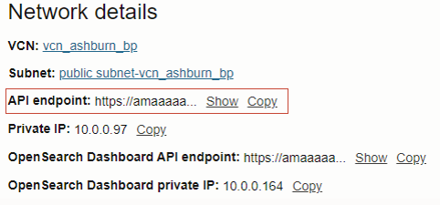

# Lab 2 - Access the Dashboard and index creation

## Introduction

In this lab, you will access the OCI OpenSearch Dashboard using NGIX.

*Estimated Time:* 20 minutes

### Objectives

In this lab, you will:
* Create a compute instance with NGINX to access the dashboards
* Create a new index and add data to to the index using the compute


## Task 1: Create a compute host with NGINX to access the dashboards

In the below steps, we use Oracle Linux, you can choose any O.S., please note that paths may be slightly different on specific opereating systems.

1.	Click on the hamburger menu, go to **Compute** and click on **Instances**. Click on **Create Instance**.

   
   
2.	Change the **Name** to NGINX-host. All default settings are fine, however, feel free to change the Instance Shape. In this example, we are using Oracle Linux 8 as image.
3.	In the **networking options**, make sure to select the same VCN as you just created. Select the **Public Subnet**.

   

4. In the **Add SSH Keys** box, make sure to either click on **Save private key** or upload your public key. For more information on the different options to connect to the instance, visit this [Connect to your instance](https://docs.oracle.com/en-us/iaas/Content/GSG/Tasks/testingconnection.htm) page.
5. When you completed the steps, click on **Create instance**. This will take 10 - 20 seconds before the instance is active.
6. When the instance is **Active**, use the Public IP address and Username to SSH into the instance. See [here](https://docs.oracle.com/en-us/iaas/Content/GSG/Tasks/testingconnection.htm) for more details on how to SSH into your instance.

   


7. In your terminal of choice, run the following command. This will set SELinux to permissive temporarily. To make the change persistent, [follow these steps](https://community.oracle.com/customerconnect/discussion/636723/how-to-set-selinux-to-permissive-mode).
    ```
    sudo setenforce 0
    ```

8. Next, run the following command. The below will install NGINX on your instance. When finished, the terminal should state **Complete!**.
    ```
    sudo yum install nginx -y
    ```

   


9. Run the below command in the terminal to make sure the NGINX service is enabled and that on reboot, the service automatically enables.
   ```
   sudo systemctl enable --now nginx.service
   ```
    
10. In Oracle Cloud, in the overview page of your OpenSearch cluster. You will find the **OpenSearch Dashboard Private IP**. NGINX will use this private IP to forward the HTTP traffic towards. Find the Private IP and use the private IP in the next step.

   

11. Copy the below statement and replace the **[ADD_YOUR_DASHBOARD_PRIVATE_IP_HERE]** with your dashboard's private IP. The OpenSearch private IP is only visible when the cluster is Active.
   ```
   upstream backend {
      server [ADD_YOUR_DASHBOARD_PRIVATE_IP_HERE]:5601;}
   ```

12. Go back to your terminal and run the below. This will open the config file for the NGINX. In this config file, we can add the routing from http traffic towards the OpenSearch dashboards using the public IP of the instance you are working on.
   ```
   sudo nano /etc/nginx/nginx.conf
   ```

13. The previous command opens the file, you can now edit the file. Use the arrows to go down to the **http** section. Add between **access_log** and **sendfile** a new line, being the statement from step 9. Make sure you changed the Dashboard's private IP.

   

14. When you added the statement, scroll down until you see **location**. Similar to the previous step, change the file using the below statement. When done, hit **CRTL + X** to close the file, select **Y** to save the changes made and following hit enter to overwrite the current file.

    ```
    location / {
          proxy_pass https://backend;
        }
    ```

   


15. When you closed and saved the config file. Run the below statement in the terminal to open the instance's firewall so it can accept and process http traffic towards the OpenSearch dashboards. The result should **success**.

    ```
    sudo firewall-cmd --add-service=http --permanent
    sudo firewall-cmd --reload
    ```

16. Run the below commmand. This will reload the changed config and restart the NGIX service. After this change, the NGINX is active with the changes made.
    ```
    sudo systemctl restart nginx
    ```

17. Optionally. You can review the status of the NGINX server by running the below command.
    ```
    sudo systemctl status nginx
    ```

   

18. You can now open the OCI OpenSearch dashboard by using the public IP. Use the public IP of you compute instance in any browser. Make sure to use **http://**. and make sure you are not on VPN. You can log in using the credentials you provided when creating the OCI OpenSearch cluster. Additionally, make sure your security list in your Public Subnet allows traffic from outside.

    An example of a full public URL to access your OCI OpenSearch dashboard:
    ```
    http://158.101.107.97/
    ```
   


19. Optional. When you have to run debugging or you would like to see the access or error logs, run the below command. 
    ```
    sudo tail -f /var/log/nginx/access.log -f /var/log/nginx/error.log
    ```

20. Using the credentials you created when you created the OCI OpenSearch cluster, log in the dashboards. When prompted for **Select your tenant**, select the **Private** options.

   

   
## Task 2: Create a new index and add data to to the index using the compute

In this taks, you will create a new index in the OCI OpenSearch cluster and add data to the index. You will use the same compute instance that you used to create the NGINX. When you are running debugging mode, make sure to cancel the operation (CTRL+C).

1. In the terminal, run the below command. This will install Git and clone the full Github repository. There are two Python files (part_1.py and part_2.py). In part 1, the Python file will connect to your OCI OpenSearch cluster and create a new index and add data to the index. In part 2, the Python file will mimick a real-time data feed, adding new rows of data every 30 seconds to the index. The last command will install the OpenSearch Python client.

   ```
   sudo dnf install git-all -y
   git clone https://github.com/bobpeulen/oci_opensearch_ad.git
   pip3 install opensearch-py --user
   ```

   

2. In the next step, please change the below paramters in the snippet starting with "python ..". When you changed the paratmers, run the statement in the terminal. Please change the following parameters.

   - **[API_ENDPOINT]:** Change this value to the API endpoint of your OCI OpenSearch cluster. See the below screenshot. Make sure to remove the **"http://"** part and please **remove the port**.

   - **[USERNAME]:** Add your username to access the OCI OpenSearch cluster

   - **[PASSWORD]:** Add your password to access the OCI OpenSearch cluster

   - **[INDEX_NAME]:** Add the index name you would like to provide. This can be any name. In this example, we'll use "index_ad"

   

   ```
   python oci_opensearch_ad/main.py -api_endpoint [API_ENDPOINT] -username [USERNAME] -password [PASSWORD] -index_name [INDEX_NAME]
   ```
   See below for a full example. Do not use this example.
   ```
   python oci_opensearch_ad/main.py -api_endpoint amaaaaaaeicj2tia3mnm2aeijfoshjdwhtlqugrnlvapkj5pa7nhoczudzfa.opensearch.us-ashburn-1.oci.oraclecloud.com -username bobpeulen -password mypassword123 -index_name index_ad
   ```

   When you run the statement, you should see many rows like the below screenshot. This will run for a few seconds. The script is adding many rows to the index. That way, when you access the OCI OpenSearch dashboard in the next lab, you will have an index created and many rows already added to the index. The data you will use using has 4 columns and relates to latencies in seconds. The columns are:
   - **latency_min:** the minimal latency in a specific timestamp
   - **latency_max:** the maximum latency in a specific timestamp
   - **latency_diff:** the absolute difference between max and min latency a specific timestamp
   - **timestamp:** the timestamp with 5 minute intervals

   


   Additionally, the script will remain running and will add more rows every 5 minutes to the index in OCI OpenSearch. Please leave the script running.


You may now **proceed to the next lab.**

## Acknowledgements
* **Authors**:
    * [Bob Peulen](https://www.linkedin.com/in/bobpeulen/)
    * [Robert de Laat](https://www.linkedin.com/in/rdelaat/) 
* **Last Updated By/Date** - Bob Peulen, September 2024
