# Lab 3 - Create an Anomaly Detection detector

## Introduction

In this lab, you will access the OCI OpenSearch Dashboard.

*Estimated Time:* 20 minutes

### Objectives

In this lab, you will:
* Create an Anomaly Detection Detector in OCI OpenSearch
* Set up automated e-mail notification using ONS

## Task 1: Create an Anomaly Detection Detector in OCI OpenSearch

1.	Return to the OpenSearch dashboard. Click on the hamburger menu button and under **OpenSearch Plugins** select **Anomaly Detection**

2.	Click on **Create detector** to configure the anomaly detection.

  	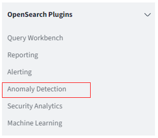
  	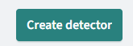

3. Etc

4. etc

5. etc

## Task 2: Set up automated e-mail notification using ONS

In this taks, you will set an alert based on the anomaly detection detector. When the alert is triggered, this will trigger the ONS service you configured before.

1. In the overview page of the just created detector, click on the **Set up alerts** button.

   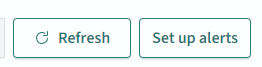

3. In the **Create Monitor** page, add a name to the **Monitor name**, select **Per query monitor** and select **Anomaly Detector** as the monitor defining method.

4. In the **Detector** list, make sure to select the detector you just created. 
   
   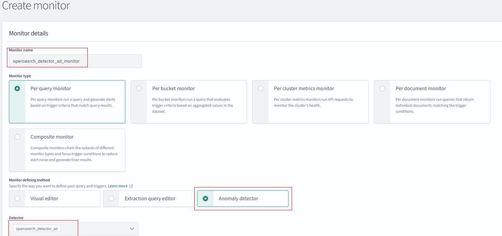

5. In the **Schedule** tab, change the **Run every** to **5 minutes**.
   
6. Click on **Add trigger**

   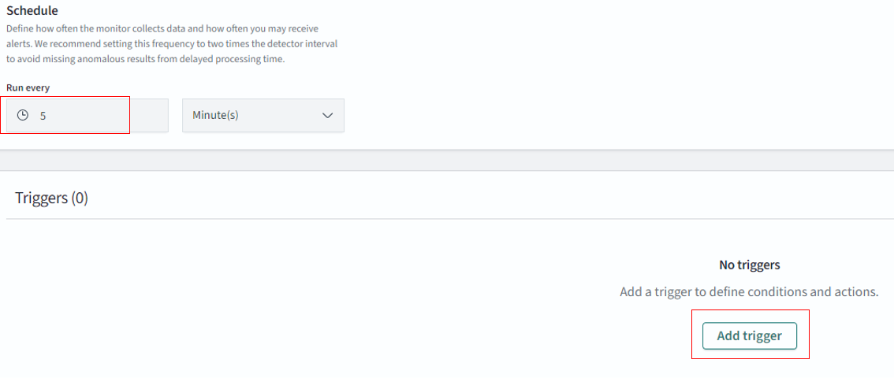

7. In the trigger overview, change the following:
   * Change the **name** to "trigger_anomaly_detection".
   * Make sure the **Trigger type** is "Anomaly Detection grade and confidence".
   * Change the **Anomaly grade treshold** to **IS ABOVE** 0.80.
   * Change the **Anomaly confidence threshold** to **IS ABOVE** 0.6.
  
     More information what algorithm is used and what the scores indicate can be found on the [OpenSearch pages](https://opensearch.org/docs/latest/observing-your-data/ad/index/).

8. When you have changed the parameters of the trigger, click on **Manage channels**. This will open a new page in your browser. Do not close the previous page.

   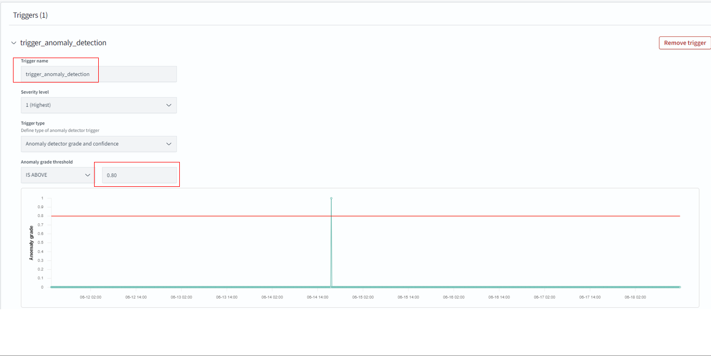

   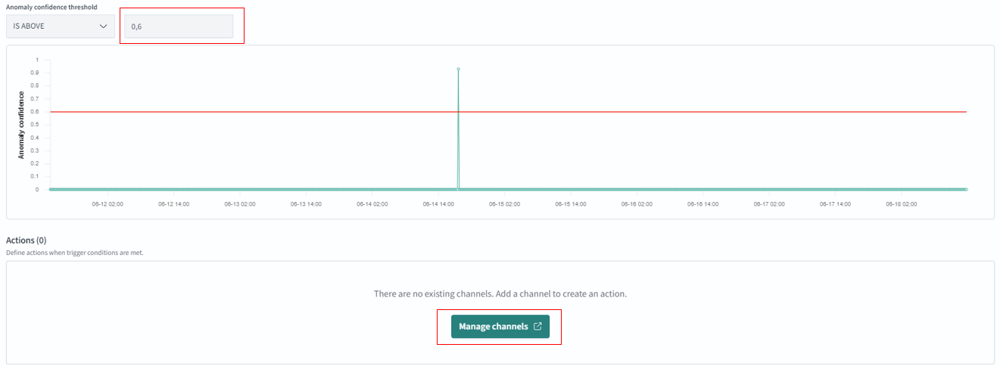

9. In the newly opened page, click on **Create channel**, please change:
   * Add a **name** for the channel
   * Select **Oracle ONS** as **Channel type**
   * Copy the ONS OCID in the **ONS Topic OCID**. You copied this OCID in Lab 1, Task 3.
  
10. Click on **Send test message**. This will trigger an example message and should appear in your inbox. See an example of a successful response in the below screenshots.

11. When successful, click on **Create**. This will create the channel.
   
   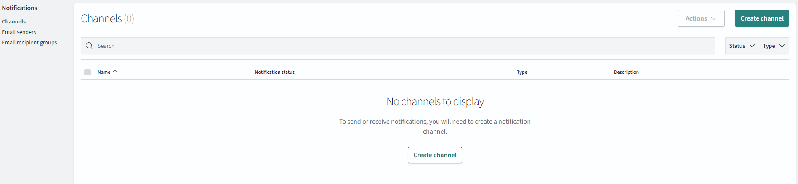
   
   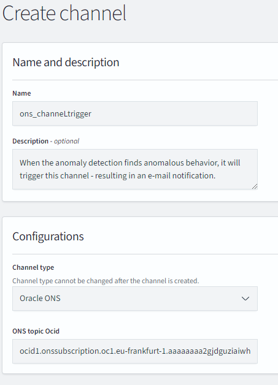

   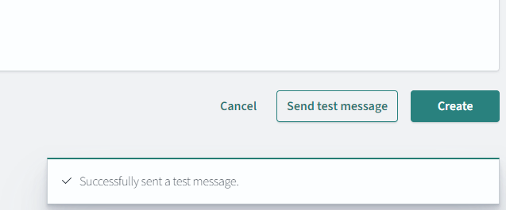

12. Please go back to the previous page (different tab in your browser). Click on **Create**. This will create the alert. The last step is to add the newly created channel to the alert and configure the e-mail response.

13. In the overview page of the trigger, click on **Edit**. You are now at the same page when you were configuring the trigger. Scroll all the way down, expand the trigger, and click on **Add action**.

14. In Action page, add a **name** for the action (e.g., "notification_anomaly_too_high"), select the **channel** you just created. Click on **Preview message** to review the e-mail in full.

  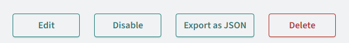

  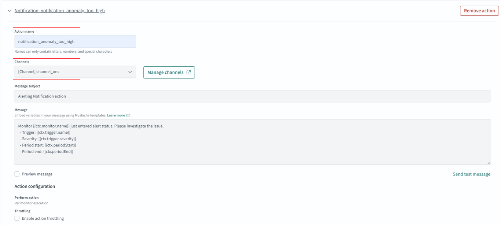

15. When done, scroll down and click on **Update**. This will update the trigger and when there is an anomaly based on the provided settings, you will receive an e-mail using the ONS.

16. Click on **View detector** to return to the real-time page running the anomaly detection.

You may now **proceed to the next lab.**

## Acknowledgements
* **Authors**:
    * x
    * x
* **Last Updated By/Date** -xa, July 2024
